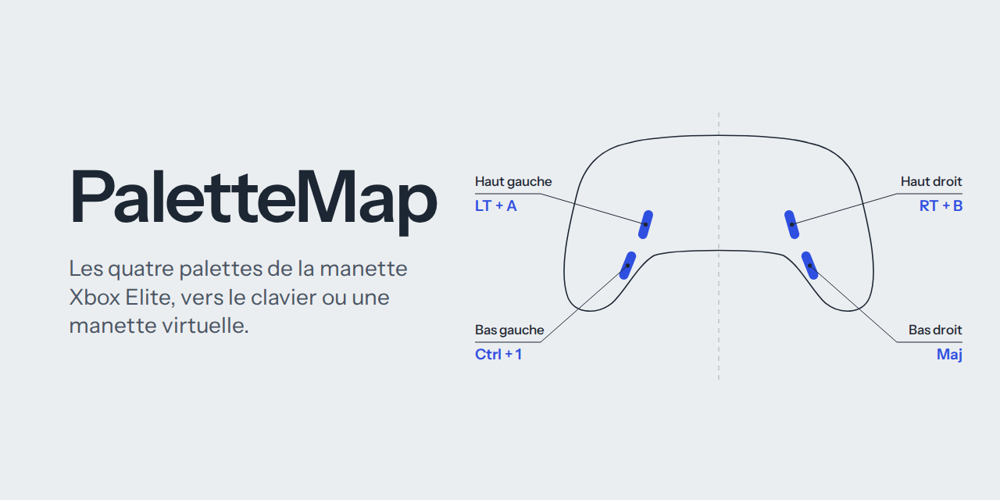

# PaletteMap

Application Windows qui affecte une touche clavier, ou une combinaison de boutons de manette, à chacune des quatre palettes arrière de la **manette Xbox Elite Series 1**. Les pilotes officiels de Microsoft ne permettent d'affecter aux palettes que des boutons de la manette elle-même ; PaletteMap lève cette limite, dans l'esprit de reWASD.

- Une affectation par palette : boutons de manette (par exemple `LT + A`), touche clavier avec Ctrl, Maj ou Alt (par exemple `Ctrl + 1`), ou les deux.
- Aucun remplacement du driver Xbox : la manette continue de fonctionner normalement dans les jeux.
- Fenêtre de réglages minimale, application discrète dans la zone de notification, lancement possible au démarrage de Windows.
- Reprise automatique après une mise en veille du PC ou un débranchement.

Page de présentation : [index.html](index.html) (publiable avec GitHub Pages).

## Comment ça marche

### Le problème

Sur l'Elite Series 1, une palette est soit assignée à un bouton (A, B, X, Y...), soit non assignée. Assignée, elle est indiscernable du bouton qu'elle imite. Non assignée, **Windows ne la voit plus du tout** : ni XInput, ni Windows.Gaming.Input, ni Steam ne peuvent la lire avec le micrologiciel actuel de la manette.

La manette, elle, continue pourtant d'envoyer l'état des palettes dans chacun de ses rapports USB. C'est cette information que PaletteMap exploite.

### Le principe

```
Manette Elite ──USB──> driver Xbox officiel ──> jeu        (inchangé)
      │
      └── USBPcap (lecture seule) ──> PaletteMap ──┬──> touche clavier (SendInput) ──> jeu
                                                   └──> manette virtuelle (ViGEmBus) ──> jeu
```

1. **Lecture.** PaletteMap observe le trafic USB grâce au driver de capture **USBPcap**, sans rien modifier : le driver Xbox officiel reste en place. Il repère les rapports d'entrée de l'Elite Series 1 (identifiant USB `045E:02E3`, rapport GIP de type `0x20` long de 33 octets) et lit leur dernier octet, qui porte l'état des palettes :

   | Palette     | Bit    |
   |-------------|--------|
   | Haut gauche | `0x01` |
   | Haut droit  | `0x02` |
   | Bas gauche  | `0x04` |
   | Bas droit   | `0x08` |

2. **Envoi.** À l'appui d'une palette, PaletteMap envoie l'affectation choisie :
   - les **touches clavier** sont simulées par Windows (`SendInput`, en codes de balayage, reconnus par les jeux DirectInput et Raw Input) ;
   - les **boutons de manette** passent par une **manette Xbox 360 virtuelle**, créée par le driver **ViGEmBus**. Cette manette virtuelle reste muette en temps normal et n'émet que les combinaisons déclenchées par les palettes. Votre vraie manette n'est ni masquée ni retransmise, il n'y a donc pas de double saisie.

3. **Ordre d'appui.** Dans une combinaison, les modificateurs de manette (LT, RT, LB, RB) sont pressés en premier, puis PaletteMap attend **25 ms** avant d'appuyer sur le reste. Certains jeux, dont World of Warcraft: Forever, ne reconnaissent la combinaison que si la gâchette est déjà maintenue. Le relâchement se fait dans l'ordre inverse.

### Pourquoi deux drivers

Une application ne peut ni lire le trafic USB d'un autre périphérique, ni créer une manette que les jeux reconnaissent : ces deux opérations se font dans le noyau de Windows, qui n'accepte que des drivers signés par Microsoft. PaletteMap s'appuie donc sur deux drivers libres et signés, installés une seule fois :

| Driver | Rôle | Obligatoire |
|---|---|---|
| [USBPcap](https://desowin.org/usbpcap/) | Lire l'état des palettes dans le trafic USB | Oui |
| [ViGEmBus](https://github.com/nefarius/ViGEmBus/releases) | Créer la manette virtuelle pour les affectations de boutons | Seulement pour les boutons de manette |

ViGEmBus a été archivé par son auteur en novembre 2023 et ne reçoit plus de mises à jour, mais il fonctionne toujours et reste utilisé par de nombreux outils (DS4Windows, etc.). Installez-le uniquement depuis sa page GitHub officielle.

Sans ViGEmBus, PaletteMap fonctionne quand même : seules les touches clavier sont alors disponibles, et le menu d'une palette l'indique.

## Prérequis

- Windows 10 ou 11, 64 bits.
- Manette Xbox Elite Series 1 **branchée en USB** (l'adaptateur sans fil n'a pas été testé).
- Droits administrateur (l'accès à USBPcap leur est réservé).

## Installation

### 1. Libérer les palettes dans Accessoires Xbox

Tant qu'une palette est assignée à un bouton, la manette la transforme elle-même en ce bouton et aucun logiciel ne peut la distinguer.

1. Installez **Accessoires Xbox** depuis le Microsoft Store, branchez la manette en USB et appliquez la mise à jour du micrologiciel si elle est proposée.
2. Créez un profil (ou modifiez-en un) et réglez les **quatre palettes sur « Non assigné »**.
3. Dans la liste déroulante en haut du profil, remplacez « Pas dans l'emplacement » par **l'emplacement 1** (ou 2).
4. Placez le **commutateur de profil** au dos de la manette sur ce même emplacement : le voyant correspondant s'allume en façade.
5. Fermez Accessoires Xbox.

### 2. Installer USBPcap

Au choix :

- téléchargez l'installateur depuis [desowin.org/usbpcap](https://desowin.org/usbpcap/) (versions également sur [GitHub](https://github.com/desowin/usbpcap/releases)) ;
- ou installez [Wireshark](https://www.wireshark.org/) en **cochant l'option « Install USBPcap »**, décochée par défaut. Npcap n'est pas nécessaire.

**Redémarrez le PC** après l'installation.

### 3. Installer ViGEmBus (pour les boutons de manette)

1. Ouvrez la [page des versions de ViGEmBus](https://github.com/nefarius/ViGEmBus/releases) et téléchargez l'installateur `.exe` de la version **1.22.0**, dans la rubrique Assets.
2. Lancez-le, acceptez les demandes de Windows, redémarrez si demandé.

Étape facultative si vous n'affectez que des touches clavier.

### 4. Installer PaletteMap

**Version compilée :** téléchargez `PaletteMap.exe` depuis la page [Releases](../../releases/latest) et placez-le dans un dossier définitif (par exemple `C:\Program Files\PaletteMap\`). L'exécutable est autonome, aucune installation de .NET n'est nécessaire.

**Depuis les sources :**

1. Installez le [SDK .NET 8](https://dotnet.microsoft.com/download/dotnet/8.0).
2. Clonez ou téléchargez ce dépôt.
3. Clic droit sur `build.cmd` > **Exécuter en tant qu'administrateur**. Le script ferme une éventuelle instance de PaletteMap, compile, et place l'exécutable dans `publish\PaletteMap.exe`.

Commande équivalente : `dotnet publish -c Release -o publish`.

### 5. Premier lancement

1. Lancez `PaletteMap.exe` et acceptez la demande d'autorisation de Windows.
2. Appuyez sur un bouton de la manette : la ligne d'état affiche **« Manette connectée »**.
3. Appuyez sur chaque palette : le témoin rond de la ligne correspondante se remplit.

## Utilisation

Un clic sur la capsule d'une palette ouvre son menu :

- **Boutons de manette** (LT, RT, LB, RB, A, B, X, Y, croix directionnelle, L3, R3, Vue, Menu) : ils se cochent sans fermer le menu, ce qui permet de composer une combinaison. Pour `LT + A`, cochez LT puis A, puis cliquez ailleurs.
- **Touche clavier…** : appuyez sur la touche voulue, en maintenant Ctrl, Maj ou Alt pour une combinaison. Ctrl, Maj ou Alt seuls sont aussi acceptés. Échap annule, Suppr retire la touche.
- **Tout effacer**.

La capsule affiche l'affectation, par exemple `LT + A` ou `Ctrl + 1`. Les réglages sont enregistrés automatiquement dans `%APPDATA%\PaletteMap\config.json`.

Fermer la fenêtre la masque : PaletteMap reste active dans la zone de notification (clic pour rouvrir, clic droit > Quitter). La case **« Lancer au démarrage de Windows »** crée une tâche planifiée qui démarre PaletteMap en arrière-plan à l'ouverture de session, avec les droits administrateur et sans demande de confirmation.

## World of Warcraft: Forever

Le mode manette (Alpha) de WoW Forever associe ses emplacements d'action à des combinaisons comme LT + A, différentes des raccourcis clavier. Affectez donc à la palette la combinaison de **boutons de manette** voulue : WoW la reçoit par la manette virtuelle.

Si une combinaison n'est pas reconnue, le délai entre la gâchette et le bouton se règle dans `Program.cs` :

```csharp
const int ModifierDelay = 25;   // ms
```

## Dépannage

| Symptôme | Cause probable | Solution |
|---|---|---|
| « USBPcap introuvable » | USBPcap non installé, PC non redémarré, ou capture déjà ouverte par Wireshark ou une autre instance de PaletteMap | Installer USBPcap et redémarrer ; fermer Wireshark ; terminer tous les processus PaletteMap dans le Gestionnaire des tâches |
| « Appuie sur un bouton de la manette » persiste | Aucun rapport reçu | Vérifier le câble USB, appuyer sur un bouton ; quitter puis relancer PaletteMap |
| Les témoins ne réagissent pas, mais A, B, X ou Y s'activent | Palettes encore assignées | Refaire l'étape 1 : profil attribué à un emplacement et commutateur sur cet emplacement |
| Les palettes ne réagissent plus après une veille | Capture interrompue | Reprise automatique en 1 à 2 secondes ; sinon quitter puis relancer |
| Menu : « Manette virtuelle indisponible » | ViGEmBus absent ou en erreur | La raison est affichée dans le menu ; installer ViGEmBus 1.22.0 |
| Les touches ne passent pas dans un jeu | Jeu lancé avec des droits supérieurs, ou anti-triche | PaletteMap tourne déjà en administrateur ; vérifier les règles du jeu sur les logiciels tiers |
| La compilation échoue | Fichier verrouillé par une instance en cours | Lancer `build.cmd` en administrateur |

## Limites

- Conçu et testé pour la **Xbox Elite Series 1 en USB**. La Series 2 et l'adaptateur sans fil utilisent d'autres formats de rapport, non pris en charge.
- La manette virtuelle apparaît comme une seconde manette : un jeu qui n'écoute qu'une seule manette ne recevra pas les boutons issus des palettes.
- Certains anti-triches refusent les entrées simulées ou les manettes virtuelles.

## Structure du dépôt

| Fichier | Contenu |
|---|---|
| `Program.cs` | Application complète : lecture USB, envoi des touches, manette virtuelle, interface |
| `PaletteMap.csproj` | Projet .NET 8, exécutable autonome en un seul fichier |
| `app.manifest` | Demande des droits administrateur |
| `build.cmd` | Compilation en une commande |
| `index.html` | Page de présentation |
| `assets/banner.png` | Bannière |

## Crédits

- [USBPcap](https://github.com/desowin/usbpcap), Tomasz Moń, licence BSD 2-Clause.
- [ViGEmBus](https://github.com/nefarius/ViGEmBus) et [ViGEm.NET](https://github.com/nefarius/ViGEm.NET), Nefarius Software Solutions.
- Police de la bannière : [Instrument Sans](https://fonts.google.com/specimen/Instrument+Sans), licence SIL Open Font License.

Projet indépendant, sans lien avec Microsoft, Xbox ou Blizzard.
